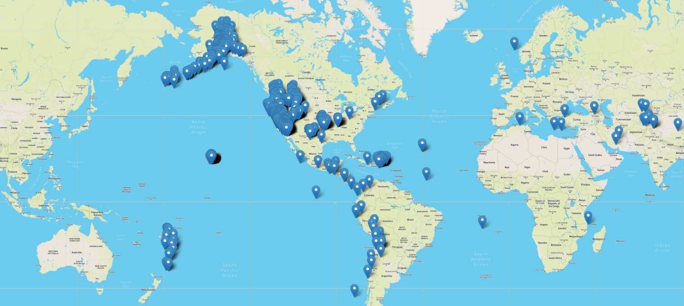
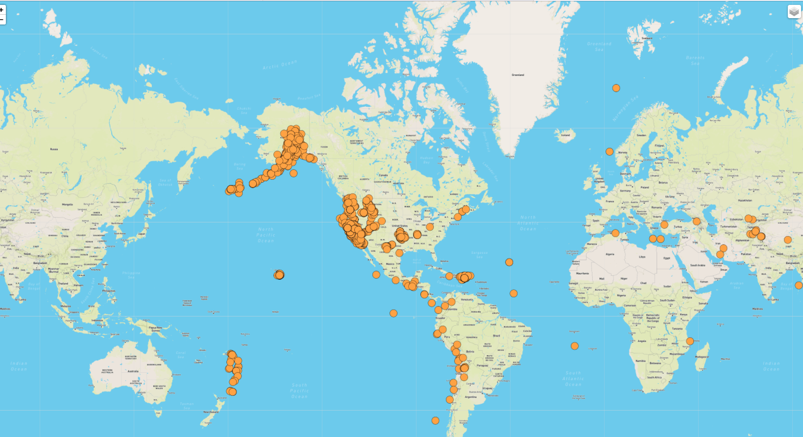
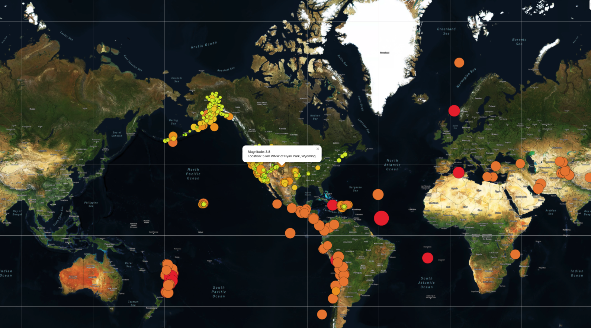
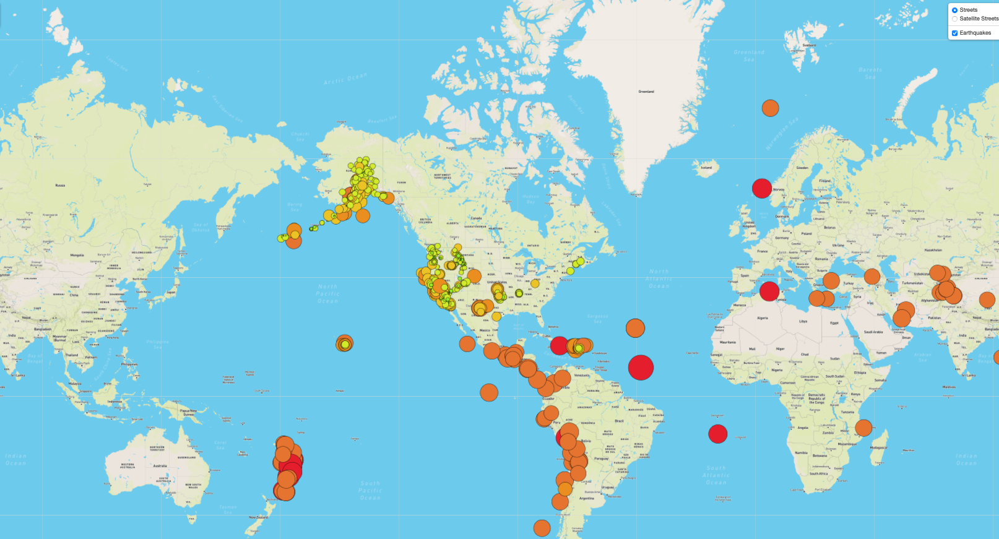
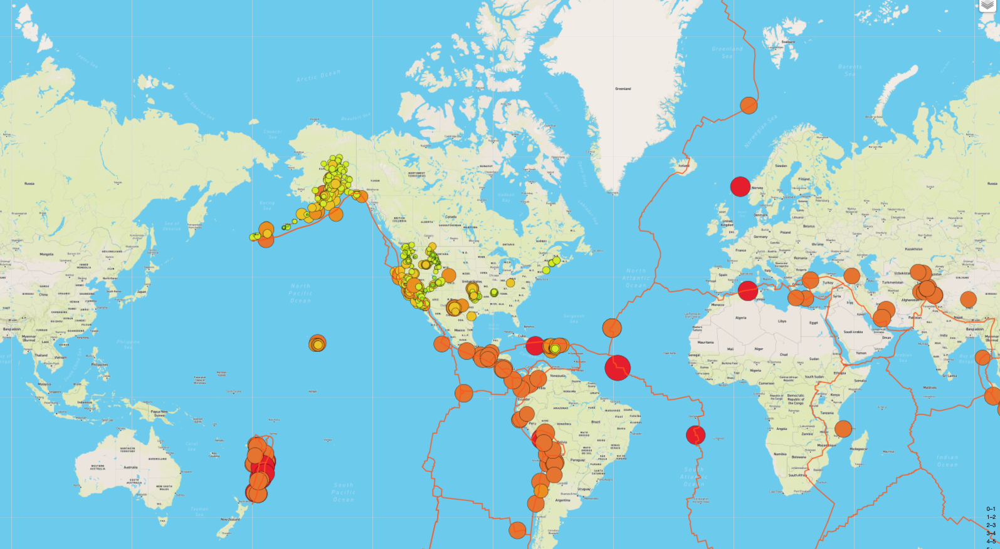
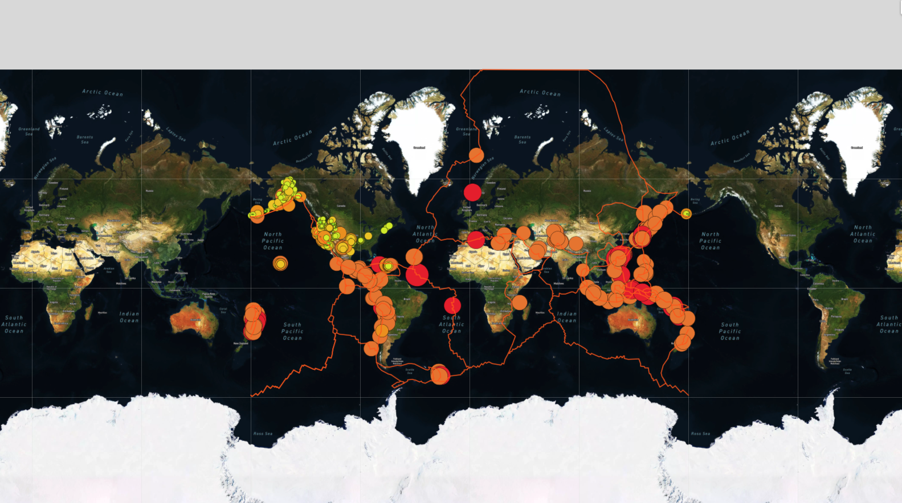
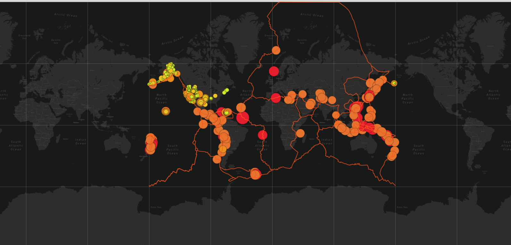
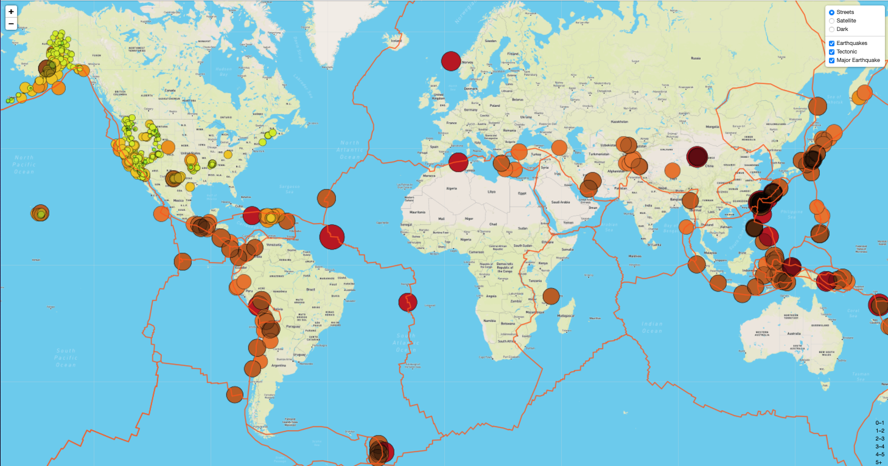
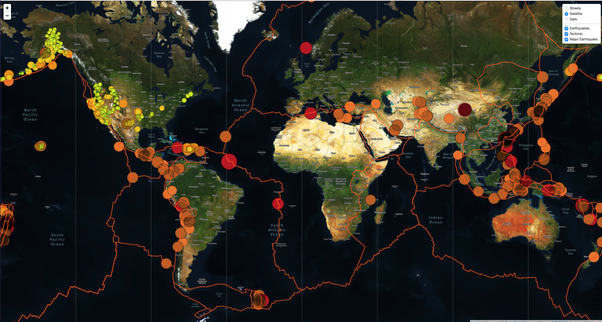
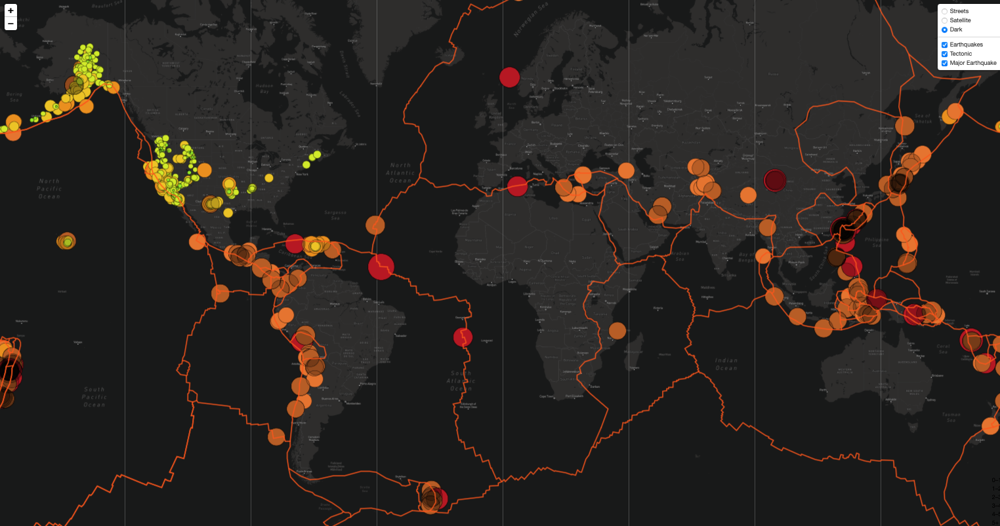

# Mapping_Earthquakes

## Overview of the Project 

In this project,we used Leaflet.js to populate a geographical map with GeoJSON earthquake data from a URL. Each earthquakes were represented by a circle and color,where higher magnitude had a larger diameter and is darker in color. Each earthquake has a popup marker, when clicked shows the magnitude of the earthquake and the location. 

## Purpose 

### Initial Analysis 

1. Create a branch from the main branch in GitHub.
2. Add,commit and push the data to GitHub branch.
3. Merge the branch with the master branch in GitHub.
4. Retrieve data from GeoJSON file.
5. Make API request to host geographical maps.
6. populate maps with GeoJSON data 
7. Add multiple layers to the maps using leaflet.

##### logicStep1.js

[logicStep1.js](Earthquakes_past7days/static/js/logicStep1.js) -  displays the map with all recorded earthquakes in past 7 days.

 

 ##### logicStep2.js

[logicStep2.js](Earthquakes_past7days/static/js/logicStep2.js) -  displays the map with all recorded earthquakes in past 7 days with some styling to the data and varied radius of each earthquake based on magnitude.

 ##### logicStep3.js

[logicStep3.js](Earthquakes_past7days/static/js/logicStep3.js) -  displays the map with all recorded earthquakes in past 7 days with some styling to the data and varied radius of each earthquake based on magnitude and also added the magnitude and location as a popup for each earthquake

 ##### logicStep4.js

[logicStep4.js](Earthquakes_past7days/static/js/logicStep4.js) -  displays the map with all recorded earthquakes in past 7 days as an overlay on both streets and satellite tile layers . 

### Updated Analysis

In this analysis, added a third map style as an additional tile laye. Added tectonicplate data to the map. Made an API call to the tectonic plate data using d3 and then added the data as an overlay to the map using leaflet, 

1. used d3 to get tectonic plate data and added as the layer  to the map using leaflet.
2. Style the tectonic plat data  in the map.
3. Added tectonic plate data as the overlay with the earthquake data on the map.
4. Added third map style to allow the user to select from 3 different maps. 

[challenge_logic.js](Earthquake_Challenge/static/js/challenge_logic.js) -  The street map is default. When selected the map style is present on the map 

Adding an overlay for the earthquake and tectonic plate on the map.

